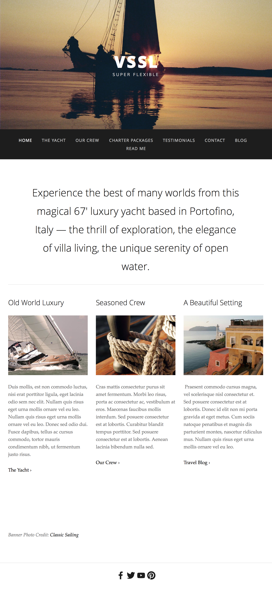

## Wireframing

A website [wireframe](https://en.wikipedia.org/wiki/Website_wireframe) is a visual guide that represents the skeletal framework of a website.  The wireframe depicts the page layout or arrangement of the website’s content, including interface elements and navigational systems, and how they work together.

The wireframe usually lacks typographic style, color, or graphics, since the main focus lies in functionality, behavior, and priority of content. In other words, it focuses on what a screen does, not what it looks like.

[A Beginner’s Guide to Wireframing](https://webdesign.tutsplus.com/articles/a-beginners-guide-to-wireframing--webdesign-7399)

You can do wireframing [online](https://wireframe.cc/) or [by hand](./wireframe_byhand.jpg).

## Setup

1. Inside the `vssl_mockup` folder, create an `index.html` file.  Make sure to create it on the same level as the `img` folder and `mockup.png`.  
2. Add the boilerplate to your html file.
3. Open `index.html` in your browser.

## Exercise

### Re-create the mockup for VSSL -- HTML First!

1. Your main focus today is to set up the HTML file for this mockup. Take a look at the mockup and think about what tags you'll need and how you'll need to organize the HTML.
2. Images - You have been provided with all of the images that you need to create this mockup in the `vssl_mockup/img` folder. Take a look at what you have before you begin.  Think about the relative path for your images when creating them in an `` tag.
3. Text - Feel free to use `lorem` in place of this real text.  

## Finished Early?

Create a `style.css` file and link it to `index.html` and get started on the CSS to style it! Remember that you can check if you attached your CSS correctly by adding a background color to the page temporarily.

Below are some resources to help you with positioning.

- [A Complete Guide to Flexbox (CSS Tricks)](https://css-tricks.com/snippets/css/a-guide-to-flexbox/)  
- [Equidistance Spacing- examples of failed attempts and wins](https://css-tricks.com/equidistant-objects-with-css/)
- [Google Fonts](https://fonts.google.com/)
